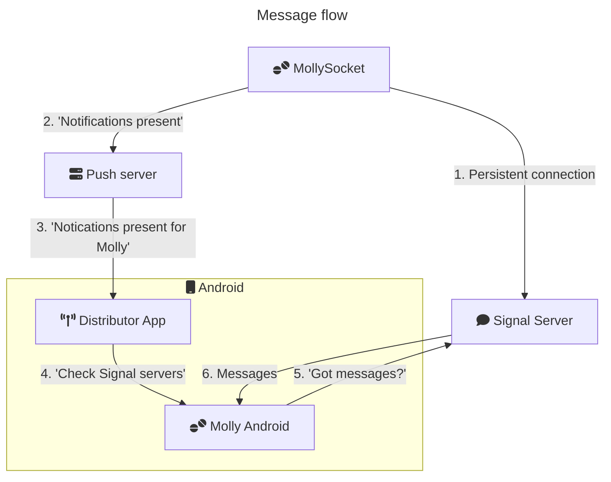

# MollySocket

MollySocket allows getting signal notifications via [UnifiedPush](https://unifiedpush.org/). It works like a linked device, which doesn't have an encryption key, connected to the Signal server. Everytime it receives an encrypted event, it notifies your mobile via UnifiedPush.

## Overview



## Setup

1. You need the right flavor of Molly to use UnifiedPush: <https://github.com/mollyim/mollyim-android-unifiedpush>.
2. You can install MollySocket via:
    1. Docker/Podman: `docker pull ghcr.io/mollyim/mollysocket:latest`
    2. Crates.io: `cargo install mollysocket` (see [INSTALL.md](INSTALL.md) for the setup) 
    3. Direct download: <https://github.com/mollyim/mollysocket/releases> (see [INSTALL.md](INSTALL.md) for the setup)
3. A [distributor app](https://unifiedpush.org/users/distributors/) (easiest is [ntfy](https://f-droid.org/en/packages/io.heckel.ntfy/))

You can optionally install your own push server like ntfy or NextPush.
For beginners, you can use a free service like ntfy.sh (do consider donating if you have the means).

## Web Server

MollySocket exposes a web server so that Molly can send the information it needs to operate. You must configure TLS with a reverse proxy in front of MollySocket. Molly can only connect to the server over HTTPS.

It is possible to use MollySocket without the web server, but you will have to manually register the information MollySocket needs: see the **Air Gapped** mode on Android settings.

## Configuration

The configuration file uses the [TOML format](https://toml.io/). Below is an overview of configuration options. You can configure each parameter using either the conf file, the environment variable or the cli option (if available).

| Parameter (conf. file) | Environment variable       | Cli Option  | Description                                       | Default              | Examples                                                |
|------------------------|----------------------------|-------------|---------------------------------------------------|----------------------|---------------------------------------------------------|
|                        | RUST_LOG                \* | -v/-vv/-vvv | Verbosity                                         | error                | RUST_LOG=info, RUST_LOG=debug                           |
|                        | MOLLY_CONF                 | -c \*       | Path to the configuration file, optional          |                      | /etc/mollysocket.conf                                   |
| host                   | MOLLY_HOST              \* |             | Listening address of the web server               | 127.0.0.1            | 0.0.0.0                                                 |
| port                   | MOLLY_PORT              \* |             | Listening port of the web server                  | 8020                 | 8080                                                    |
| webserver              | MOLLY_WEBSERVER         \* |             | Wether to start the web server                    | true                 | false                                                   |
| allowed_endpoints      | MOLLY_ALLOWED_ENDPOINTS \* |             | List of UnifiedPush servers                       | `["*"]`              | `["*"]`,`["https://yourdomain.tld","https://ntfy.sh"]`  |
| allowed_uuids          | MOLLY_ALLOWED_UUIDS     \* |             | UUIDs of signal accounts that may use this server | `["*"]`              | `["*"]`, `["abcdef-12345-tuxyz-67890"]`                 |
| db                     | MOLLY_DB                \* |             | Path to the DB                                    | `db.sqlite`          | `"/data/ms.sqlite"`                                     |

\* Takes the precedence

#### `allowed_endpoints`

These are the UnifiedPush endpoints that MollySocket may use to push notifications with. 

⚠️ **If you self-host your push server, add your push server to the `allowed_endpoints`.** ⚠️

That's because, for security reasons, endpoints on your local network must be allowed explicitly. You just have to set the scheme (https), the domain and the port if required. For instance `allowed_endpoints=['https://push.mydomain.tld']`

#### `allowed_uuids`

You can allow registration for all accounts by setting `allowed_uuids` to `['*']`. Else set your account ids in the array: `['account_id1','account_id2']`.

The account IDs are showing in the Molly application under Settings > Notifications > UnifiedPush.
You need to activate UnifiedPush first before your account ID is shown.

## Troubleshoot

* **On the Android app, the status states _MollySocket server not found_**

You haven't entered the right url.

This must be the one where MollySocket is reachable. To test it, open the link you have entered in a browser: you should see a json containing the version of MollySocket. For instance `{"mollysocket":{"version":"1.2.0"}}`.

If you can access the web server, make sure it is accessible over HTTPS. Molly can't connect to the server over HTTP.

* **On the Android app, the status states _The account ID is refused by the server_**

You have restricted the allowed account ID who can use your MollySocket server.

Add your account ID[1] to _allowed_uuids_ to allow your account, or add a wildcard `["*"]` to allow all the accounts to use your server. See [Configuration](#configuration) to configure your server correctly.

[1] Your account ID can be copied on the Android app, under the UnifiedPush settings

* **On the Android app, the status states _The endpoint is forbidden by the server_**

You have restricted the allowed UnifiedPush endpoints, or you are using a self-hosted server you haven't whitelisted.

Add your server to the _allowed_endpoints_: `["https://push.mydomain.tld"]`. _This is NOT your MollySocket URL_ but the one from your push provider. See [Configuration](#configuration) to configure your server correctly.

* **On the Android app, the status is _Air gapped, waiting for test notification_**

There might be 3 reasons for that:
- You don't have yet registered your connection on a MollySocket server.
    - It is better to use MollySocket configured with a web interface, see [Web Server](#web-server) for more information.
    - If you can't have a web interface, you can use it in air gapped mode. The MollySocket server should be constantly running. You can use the docker-compose or follow the [Install doc](/Install.md).
    - Then, if you stick with air gapped mode, you will need to add your account to the MollySocket registration. You can copy the parameter on the Android settings view. Then run:
```console
$ # If you use docker-compose:
$ docker compose run mollysocket <paste the parameters here>
$ # Else, if you use the binary:
$ mollysocket <paste the parameters here>
```
- It is possible you don't use a recent enough version of MollySocket and it hasn't send a request during the registration. You can run :
```console
$ # Replace the UUID with your account Id
$ # If you use docker-compose:
$ docker compose run mollysocket connection ping c8d44128-5c99-4810-a7d3-71c079891c27
$ # Else, if you use the binary:
$ mollysocket connection ping c8d44128-5c99-4810-a7d3-71c079891c27
```
- You have a problem with your UnifiedPush setup. You can get further troubleshooting information on this page: <https://unifiedpush.org/users/troubleshooting/>.

* **On the Android app, the status is _Waiting for test notification_**

- It is possible you don't use a recent enough version of MollySocket and it hasn't send a request during the registration. You can either:
    - Update your MollySocket server, then on Molly Android go to the linked devices settings, remove MollySocket, then go to the notifications settings, switch the delivery method to websocket then to UnifiedPush again.
    - Run :
```console
$ # Replace the UUID with your account Id
$ # If you use docker-compose:
$ docker compose run mollysocket connection ping c8d44128-5c99-4810-a7d3-71c079891c27
$ # Else, if you use the binary:
$ mollysocket connection ping c8d44128-5c99-4810-a7d3-71c079891c27
```
- You have a problem with your UnifiedPush setup. You can get further troubleshooting information on this page: <https://unifiedpush.org/users/troubleshooting/>.

* **I use the Air-gapped mode and I don't receive notifications**.

If you use air-gapped mode, then Molly (android) can't test the setup and it assumes you have correctly setup everything. You should double check that the account ID is accepted by your mollysocket server and the endpoint is allowed by your mollysocket server (check the output logs).

* **The status is "OK" or "OK: Air Gapped" but I still don't get notifications**

If you are using Molly version >= 7.1.3-1.up1 and MollySocket version >= 1.3.0, you can run this command:

```console
$ # Replace the UUID with your account Id
$ # If you use docker-compose:
$ docker compose run mollysocket connection ping c8d44128-5c99-4810-a7d3-71c079891c27
$ # Else, if you use the binary:
$ mollysocket connection ping c8d44128-5c99-4810-a7d3-71c079891c27
```

If you receive a test notification (image bellow), then you should check that Molly and your [distributor](https://unifiedpush.org/users/distributors/) have unrestricted battery usage. You should check if you have additional configuration for your device regarding battery management: <https://dontkillmyapp.com/>.


If you don't receive a test notification, then your MollySocket server can't reach your push server or your phone don't have network access.

You can get further troubleshooting information on this page: <https://unifiedpush.org/users/troubleshooting/>.

## About security

**Relative to Signal security**

**MollySocket never has any encryption key**

MollySocket receives the credentials for a linked device and does not receive any encryption key. Which means:
* Someone with access to MollySocket database can't change the identity key, to impersonate users. See [setKeys](https://github.com/signalapp/Signal-Server/blob/v8.67.0/service/src/main/java/org/whispersystems/textsecuregcm/controllers/KeysController.java#L111).
* Someone with access to MollySocket database may be able to use the credentials of linked devices to spam the Signal server and hit the rate limits. I haven't checked if this would temporarily block the account or just the linked device. (Availability risk)
* Someone with access to MollySocket database may be able to change some account field in a destructive way. For instance changing the account Name to something random. The cleartext will be random since these field are encrypted and require encryption keys to be properly encrypted.

## License
AGPLv3: see [LICENSE.txt](./LICENSE.txt).

## Disclaimer
This project is NOT sponsored by or affiliated to Signal Messenger or Signal Foundation.

The software is produced independently of Signal and carries no guarantee about quality, security or anything else. Use at your own risk.

